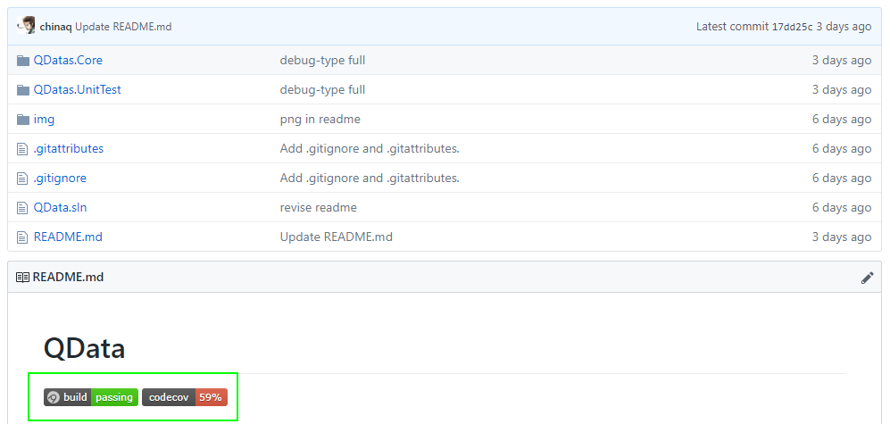

# CI on dotnet core

- [CI on dotnet core](#ci-on-dotnet-core)
    - [AppVeyor & Codecov](#appveyor--codecov)
    - [Problems](#problems)
    - [Solution](#solution)
    - [Deploy Nuget](#deploy-nuget)

## AppVeyor & Codecov
- [好代码是管出来的——使用GitHub实现简单的CI/CD](https://mp.weixin.qq.com/s/1mXkOhy_WANC1MDil3XIjA)
- [AppVeyorとCodecovを使ってC#のコードカバレッジを計測する](https://yoshinorin.net/2016/09/21/appveyor-codecov-csharp/)

## Problems

    Committing…
    No results, this could be for a number of reasons. The most common reasons are:
    1) missing PDBs for the assemblies that match the filter please review the
    output file and refer to the Usage guide (Usage.rtf) about filters.
    2) the profiler may not be registered correctly, please refer to the Usage
    guide and the -register switch.

- [Code coverage of .NET Core unit tests with OpenCover](https://automationrhapsody.com/code-coverage-net-core-unit-tests-opencover/)

## Solution
- set opencover for dotnet core
    - set .csproj on `<DebugType>full<DebugType/>`
        -     Make sure all covered projects generate full pdb file (not only test projects), either through <DebugType>full</DebugType> in the .csproj file or by using a Visual Studio: Project Properties > Build > Advanced > Debugging information. By default, projects created by dotnet or by Visual Studio use a portable format for pdb files. Support for portable pdb format hasn't been released in OpenCover yet. If you fail to set full pdb, the OpenCover will print out a message notifying you that it has no results along with common causes.

    - set command on `-oldstyle`
        -     where -oldstyle switch is necessary, because .NET Core uses System.Private.CoreLib instead of mscorlib and thus OpenCover can't use mscorlib for code instrumentation.
    - example
        - `OpenCover.Console.exe -register:user -target:"C:/Program Files/dotnet/dotnet.exe" -targetargs:test -filter:"+[UnitTestTargetProject*]* -[MyUnitTests*]*" -output:".\MyProject_coverage.xml" -oldstyle`
    - doc on github
        - [codecov/example-csharp](https://github.com/codecov/example-csharp#net-core-project)

## Deploy Nuget
- 
- [PUBLISHING A PACKAGE FROM APPVEYOR TO NUGET.ORG](https://www.thomaslevesque.com/2016/04/20/publishing-a-package-from-appveyor-to-nuget-org/)